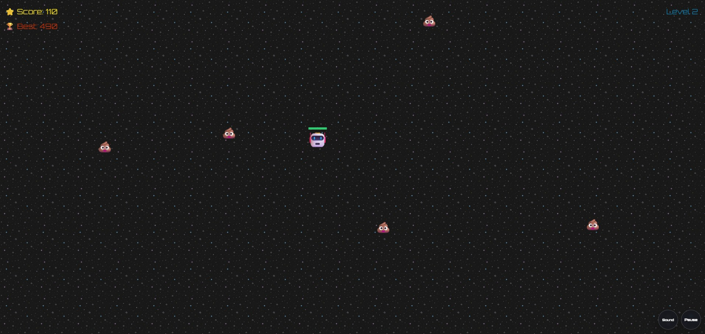

# Emoji Survivors



A fast-paced emoji survival game built with **Phaser** and **TypeScript**.
Fight through waves of enemies, survive longer to scale the difficulty, and use both keyboard and mobile touch controls to stay alive.

## Overview

Emoji Survivors is a compact browser game designed as a portfolio project that demonstrates practical front-end game development skills:

- scene-based architecture
- responsive canvas scaling
- custom mobile controls
- keyboard and touch input handling
- arcade physics and collision logic
- HUD, pause, mute, and game-over states
- difficulty scaling and boss spawning

## What This Project Demonstrates

This project highlights strengths that are useful on a resume and in real-world development:

- **TypeScript-first development** with clear scene and gameplay separation
- **Phaser game architecture** using dedicated scenes for menu and gameplay
- **Responsive UI thinking** with resize handling for desktop and mobile layouts
- **Input system design** that supports keyboard controls and on-screen touch controls
- **Gameplay systems design** including spawning, combat, health, score, and level progression
- **Polished user experience** with pause, mute, game-over feedback, and mobile-friendly interaction
- **Maintainable structure** with reusable helpers for actors, layout, sound, and controls

## Features

- Main menu with start interaction
- Endless survival gameplay loop
- Player movement and auto-attacks
- Enemies that chase the player
- Boss enemies with higher health and speed changes
- Health bar, score, and level HUD
- Pause and mute controls
- Mobile on-screen movement and action buttons
- Responsive resize support

## Tech Stack

- **TypeScript**
- **Phaser**
- **Vite**
- **HTML / CSS**

## Project Structure

```text
src/
  game/
  scenes/
  ui/
  main.ts
```

## Running Locally

```bash
npm install
npm run dev
```

## Build

```bash
npm run build
```

